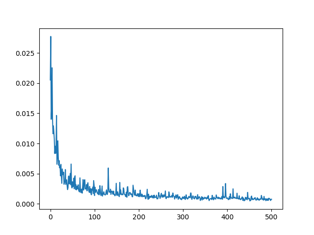
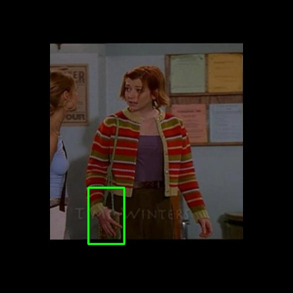

# YOLOv3 
This is an implementation of YOLOv3 model trained on the Oxford Hands Dataset.
# Steps to train
1. Download the annotations and image dataset from [here] :https://drive.google.com/file/d/1KHzFdt3ZpdOcvyGgmfdqZsn-8-088JO6/view?usp=sharing and place it in the "data" folder.  
	data  
	 | 
	 | 
	 |_\__\_\_train  
		 | 
		 |_\_\_\_ Buffy_0.jpg  
		 |_\_\_\_ Buffy_0.txt  
			....
2. If you already have a checkpoint file, include it at train.py. (checkpoint=checkpoint_file)  
3. Change the other model parameters, if necessary, at train.py file.  
4. Execute "train.py" and watch the magic. B-)  

# Steps to Predict
1. Change the testing image at predict.py.  
2. Include the desired checkpoint to be used at predict.py.  
3. Execute "predict.py" and watch the model magically detect the hands. :D  

Below are the result of training the model on a small subset of Oxford Hands Dataset.  
1. Graph of loss for 500 epochs (Epochs: 6500-7000)
  
2. Validating the model on an image   
&nbsp; &nbsp; &nbsp;   

With a little tweaking, the model can be trained on other datasets as well. ;)  

Go ahead, pull it, train it and have fun. :)  

